# AmazingHand Demo de Hackathon

<div align="center">

<a href="https://www.seeedstudio.com/Amazing-Hand-Right-Hand-The-Open-Source-Robotic-Hand-Developer-Kit.html" target="_blank">
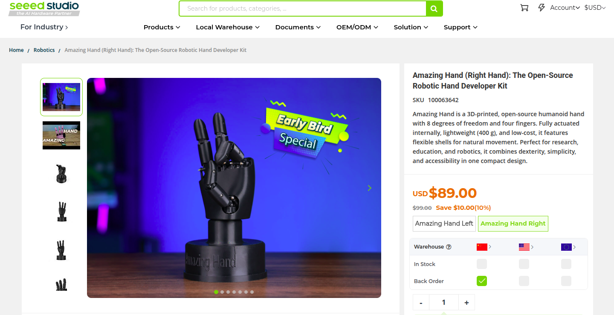
</a>

### 🔥 [🛒 Comprar Kit de Desarrollo AmazingHand Ahora](https://www.seeedstudio.com/Amazing-Hand-Right-Hand-The-Open-Source-Robotic-Hand-Developer-Kit.html) 🔥


## 🌐 Idioma / Language / 语言
**[🇪🇸 Español](README_ES.md)** | **[🇺🇸 English](README_EN.md)** | **[🇨🇳 中文](README.md)**

## 🤖 Resumen del Proyecto

Esta es una colección de demos de hackathon para el proyecto de mano robótica AmazingHand, presentando múltiples soluciones de control completas.

</div>

## 📸 Galería del Proyecto

### Caso 1: Control por Gestos y Reproducción de Puntos
<table>
<tr>
<td>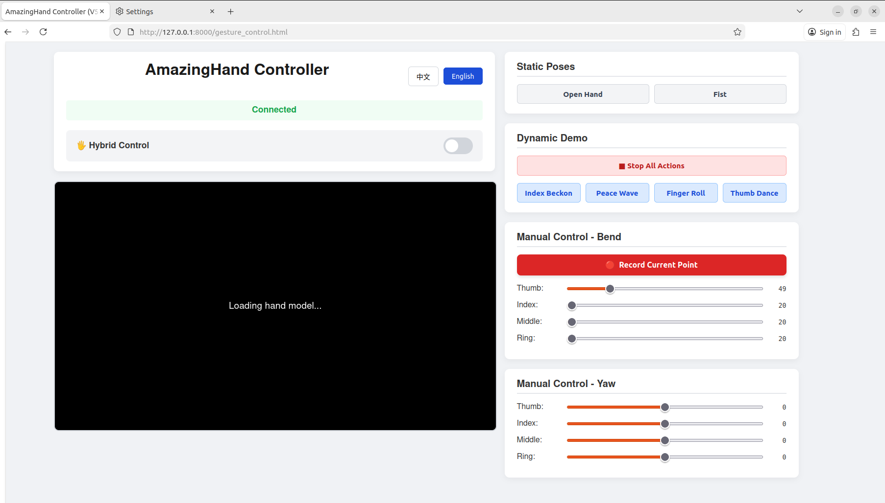</td>
<td>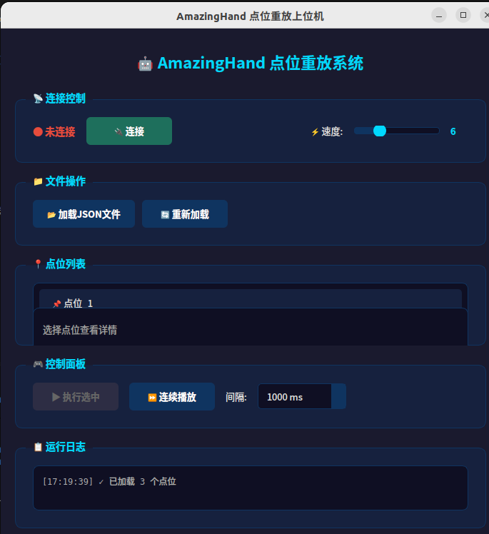</td>
</tr>
<tr>
<td align="center">Interfaz Web de Control por Gestos</td>
<td align="center">GUI de Reproducción de Puntos</td>
</tr>
</table>

### Caso 2: Monitor de Servos y Enseñanza
<table>
<tr>
<td>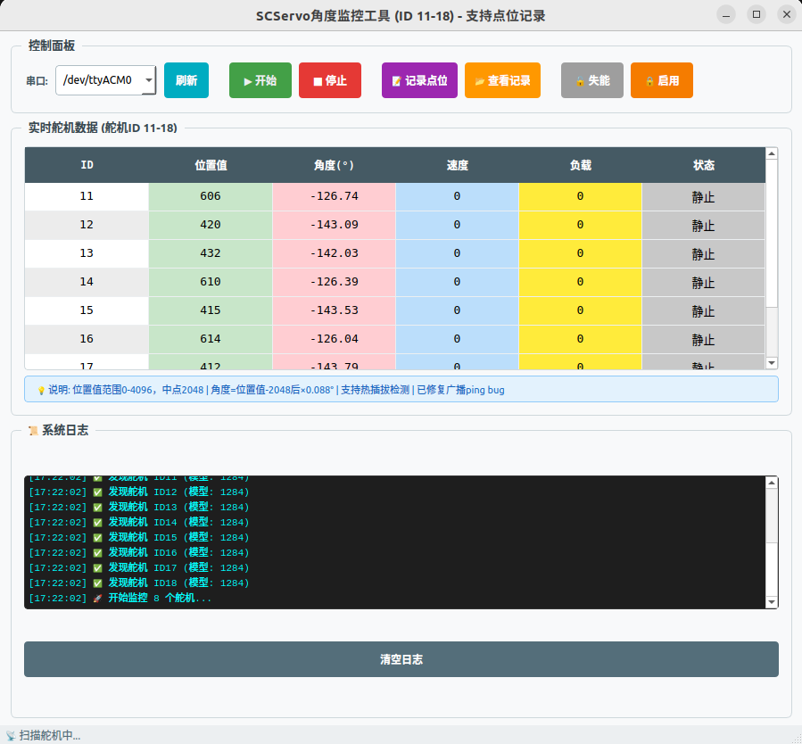</td>
</tr>
<tr>
<td align="center">Interfaz de Monitor en Tiempo Real de Servos</td>
</tr>
</table>

### Caso 3: Control Dinámico de GDL Completo
<table>
<tr>
<td>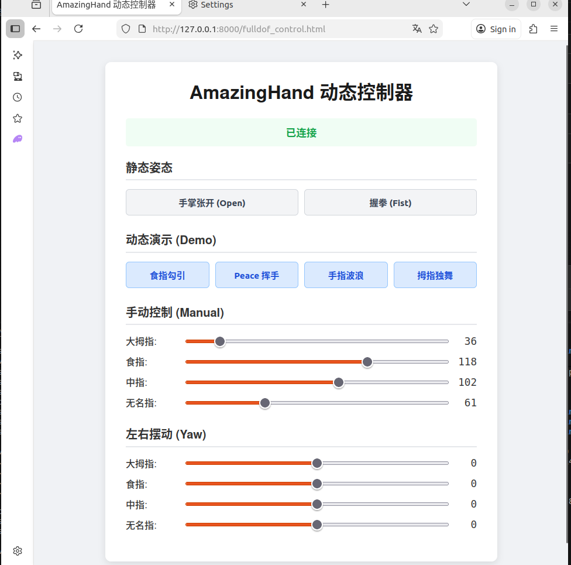</td>
</tr>
<tr>
<td align="center">Interfaz Web de Control Preciso</td>
</tr>
</table>

### Caso 4: Control de Simulación MuJoCo
<table>
<tr>
<td>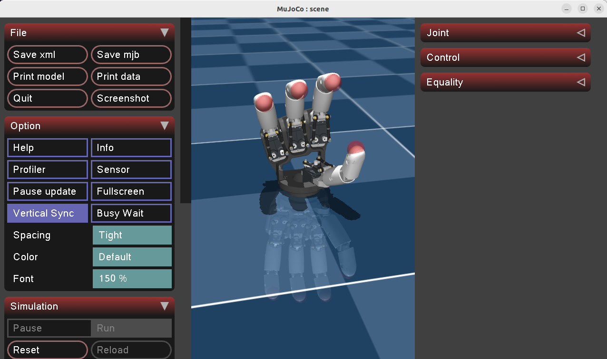</td>
<td>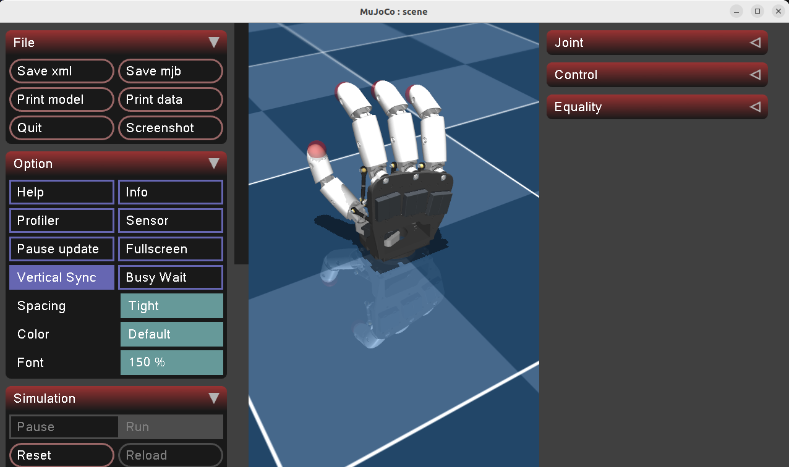</td>
<td>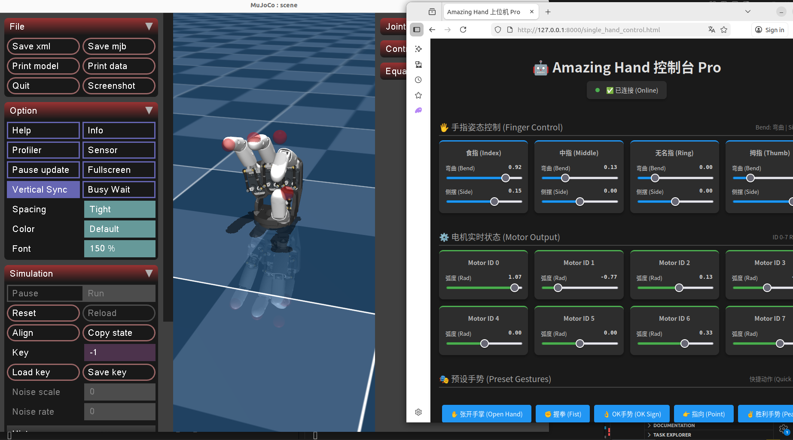</td>
</tr>
<tr>
<td align="center">Simulación Física MuJoCo</td>
<td align="center">Control Web de Mano Única</td>
<td align="center">Control Cooperativo de Manos Dobles</td>
</tr>
</table>

### Caso 5: Control Empotrado ESP32-C3
<table>
<tr>
<td>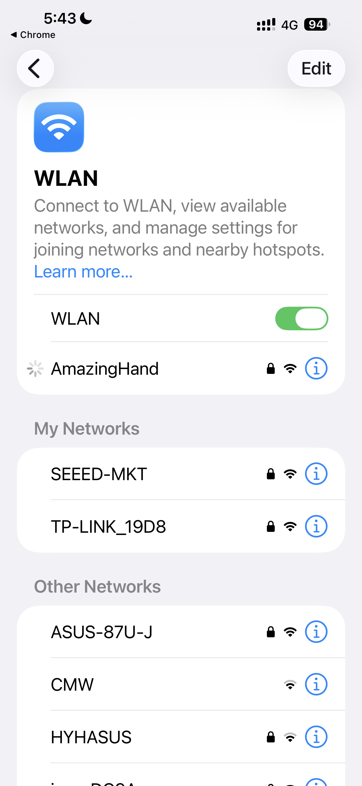</td>
<td>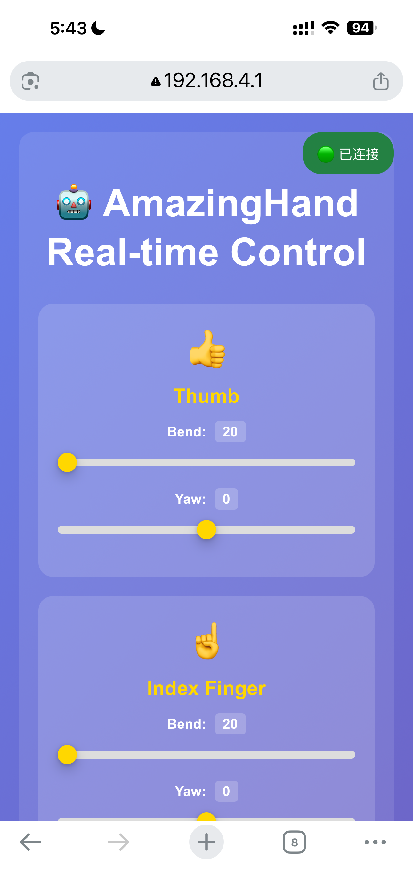</td>
<td>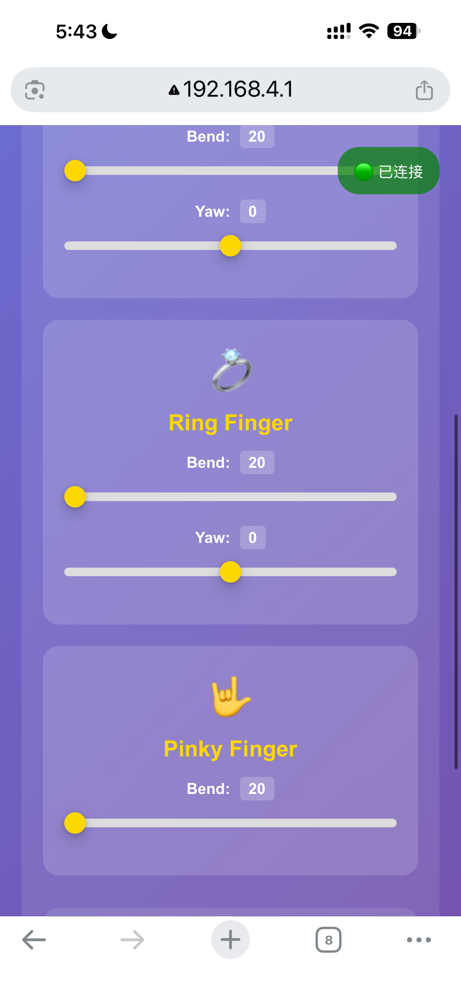</td>
<td>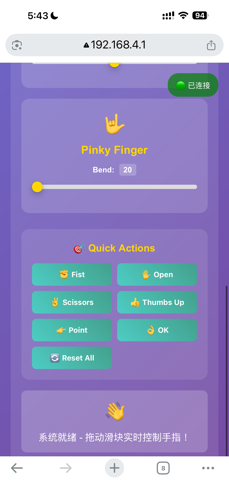</td>
</tr>
<tr>
<td align="center">Hardware ESP32-C3</td>
<td align="center">Control Web WiFi</td>
<td align="center">Adaptación Móvil</td>
<td align="center">Operación Portátil Independiente</td>
</tr>
</table>

## 📋 Lista de Casos

| Caso | Nombre | Descripción | Stack Tecnológico |
|------|--------|-------------|-------------------|
| [**caso1**](./case1/) | 🖐️ Control por Gestos y Reproducción de Puntos | WebSocket + reconocimiento de gestos web + reproducción PySide6 | rustypot, MediaPipe, WebSocket |
| [**caso2**](./case2/) | 📊 Monitor de Servos y Enseñanza | SDK FTServo + monitoreo en tiempo real + grabación de puntos | FTServo SDK, PySide6 |
| [**caso3**](./case3/) | 🎯 Control Dinámico de GDL Completo | WebSocket + control preciso + demo dinámico | rustypot, WebSocket |
| [**caso4**](./case4/) | 🧮 Control de Simulación MuJoCo | simulación física + control web + visualización 3D | MuJoCo, FastAPI, HTML5 |
| [**caso5**](./case5/) | 📡 Control Empotrado ESP32-C3 | microcontrolador + control WiFi + independiente | ESP32-C3, Arduino, WiFi |

## 🚀 Inicio Rápido

### 📌 Caso 1: Solución de Control por Gestos

```bash
cd case1

# 1. Iniciar servidor WebSocket
python websocket_server.py

# 2. Abrir interfaz de control web
# Abrir gesture_control.html en el navegador

# 3. (Opcional) Usar GUI para reproducción de puntos
python playback_gui.py
```

> 💡 **Ideal para**: reconocimiento de gestos, control web remoto, grabación y reproducción de movimientos

---

### 📌 Caso 2: Solución de Monitor de Servos

```bash
cd case2

# Iniciar GUI de monitoreo
python servo_monitor.py
```

> 💡 **Ideal para**: depuración de servos, enseñanza manual, monitoreo de estado

---

### 📌 Caso 3: Solución de Control Dinámico de GDL Completo

```bash
cd case3

# Iniciar servidor
python fulldof_server.py

# Abrir interfaz de control
# Abrir fulldof_control.html en el navegador
```

> 💡 **Ideal para**: control preciso, demostración dinámica, investigación de gestos

---

### 📌 Caso 4: Solución de Control de Simulación MuJoCo

```bash
cd case4

# Simulación de mano única
python simulation_server.py

# Simulación de manos dobles (opcional)
python dual_hand_simulation.py --mode both

# Abrir interfaz de control
# Abrir single_hand_control.html o dual_hand_control.html en el navegador
```

> 💡 **Ideal para**: validación de algoritmos, demostración educativa, desarrollo de prototipos sin hardware

---

### 📌 Caso 5: Solución de Control Empotrado ESP32-C3

```bash
cd case5

# Enfoque Arduino IDE
# Abrir esp32_controller.ino
# Seleccionar placa: XIAO ESP32-C3
# Compilar y subir

# Enfoque PlatformIO (recomendado)
pio run --target upload
pio device monitor

# Control WiFi
# Después de subir src/esp32_main.cpp
# Conectar al hotspot WiFi "AmazingHand"
# Visitar http://192.168.4.1
```

> 💡 **Ideal para**: demostración independiente, control portátil, aplicaciones empotradas

---

### 📌 Herramientas: Colección de Utilidades

```bash
cd tools

# Herramienta de centrado de servos (soporta 16 servos)
python servo_center.py

# Herramienta simple de centrado
python simple_center.py
```

> 💡 **Ideal para**: inicialización de mano robótica, calibración de servos, depuración básica

## ⚙️ Soporte de Hardware

| Caso | Requisito de Hardware | Descripción |
|------|----------------------|-------------|
| Caso 1-3 | ✅ Mano Robótica AmazingHand | 8 servos (ID 11-18), 4 dedos, 2 servos por dedo (flexión + balanceo) |
| Caso 4 | ❌ No se requiere Hardware | Simulación pura de software |
| Caso 5 | ✅ ESP32-C3 | Hardware microcontrolador con soporte de control WiFi |

### 🦾 Especificaciones de la Mano Robótica
- **Cantidad de Servos**: 8 servos (ID 11-18)
- **Configuración de Dedos**: 4 dedos (Pulgar, Índice, Medio, Anular)
- **GDL**: 2 grados de libertad por dedo (flexión + balanceo)

## 📊 Comparación Técnica

| Característica | Caso 1 | Caso 2 | Caso 3 | Caso 4 | Caso 5 |
|----------------|--------|--------|--------|--------|--------|
| **SDK de Servos** | rustypot | FTServo (FEETECH) | rustypot | Ninguno (simulación pura) | SCServo |
| **Método de Control** | 🌐 WebSocket Remoto | 🔌 Serie Local | 🌐 WebSocket Remoto | 📡 HTTP API | 📶 Control Empotrado |
| **Interfaz de Usuario** | 🌐 Web + 💻 PySide6 | 💻 PySide6 | 🌐 Web | 🌐 Web | 📶 WiFi Web |
| **Reconocimiento de Gestos** | ✅ (MediaPipe) | ❌ | ❌ | ❌ | ❌ |
| **Monitoreo en Tiempo Real** | ⚡ Básico | 📊 Detallado | ⚡ Tiempo Real | ⚡ Tiempo Real | ⚡ Tiempo Real |
| **Control Preciso** | ✅ | ✅ | ✅ Soporte Completo | ✅ | ✅ |
| **Demo Dinámico** | ✅ | ❌ | ✅ | ✅ | ✅ |
| **Simulación Física** | ❌ | ❌ | ❌ | ✅ (MuJoCo) | ❌ |
| **Requisito de Hardware** | 🔧 Requerido | 🔧 Requerido | 🔧 Requerido | 💻 No Requerido | 🔧 Requerido (ESP32) |
| **Operación Independiente** | ❌ | ❌ | ❌ | ❌ | ✅ |

## 📁 Estructura de Directorios

```bash
hackathon_demo/
├── 📄 README.md                    # Este documento
├── 📄 README_EN.md                 # Versión en inglés
├── 📄 README_ES.md                 # Versión en español
├── 📂 case1/                       # 🖐️ Solución de control por gestos
│   ├── 📄 README.md
│   ├── 🐍 websocket_server.py      # Servidor WebSocket
│   ├── 🌐 gesture_control.html     # Interfaz web de control por gestos
│   ├── 💻 playback_gui.py          # GUI de reproducción de puntos
│   └── 📸 case_1_1.png, case_1_2.png # Capturas de interfaz
├── 📂 case2/                       # 📊 Solución de monitor de servos
│   ├── 📄 README.md
│   ├── 🐍 servo_monitor.py         # GUI de monitor de servos
│   ├── 📂 FTServo_Python/          # SDK de servos FEETECH
│   └── 📸 case_2_1.png             # Captura de interfaz
├── 📂 case3/                       # 🎯 Solución de control GDL completo
│   ├── 📄 README.md
│   ├── 🐍 fulldof_server.py        # Servidor GDL completo
│   ├── 🌐 fulldof_control.html     # Interfaz de control preciso
│   └── 📸 case_3_1.png             # Captura de interfaz
├── 📂 case4/                       # 🧮 Solución de simulación MuJoCo
│   ├── 📄 README.md
│   ├── 🐍 simulation_server.py     # Servidor de simulación de mano única
│   ├── 🐍 dual_hand_simulation.py  # Servidor de simulación de manos dobles
│   ├── 🌐 single_hand_control.html # Interfaz de control de mano única
│   ├── 🌐 single_hand_control_en.html # Interfaz de control de mano única(Inglés)
│   ├── 🌐 dual_hand_control.html   # Interfaz de control de manos dobles
│   ├── 📂 AHSimulation/            # Modelos de simulación
│   │   ├── 📂 AH_Right/           # Modelo de mano derecha
│   │   └── 📂 AH_Left/            # Modelo de mano izquierda
│   ├── 📄 dual_hand_model.xml     # Archivo de modelo de manos dobles
│   └── 📸 case_4_1.png, case_4_2.png, case_4_3.png # Capturas de interfaz
├── 📂 case5/                       # 📡 Solución empotrada ESP32-C3
│   ├── 📄 README.md                # Documentación detallada
│   ├── 📄 esp32_controller.ino     # Programa principal Arduino
│   ├── 📄 servo_scanner.ino        # Utilidad de escáner de servos
│   ├── 📂 src/esp32_main.cpp       # Programa principal PlatformIO
│   ├── 📄 platformio.ini           # Configuración PlatformIO
│   ├── 📂 lib/                     # Dependencias
│   ├── 📄 WIFI_SETUP_GUIDE.md      # Guía de configuración WiFi
│   ├── 📄 FINGER_CONTROL_GUIDE.md  # Guía de control
│   └── 📸 case_5_1.png ~ case_5_4.png # Capturas de hardware e interfaz
└── 📂 tools/                       # 🔧 Colección de utilidades
    ├── 📄 README.md                # Documentación de uso de herramientas
    ├── 🐍 servo_center.py          # Herramienta de centrado de servos
    └── 🐍 simple_center.py         # Herramienta simple de centrado
```

## 🛠️ Instalación de Dependencias

### 📦 Dependencias Comunes
```bash
pip install pyside6 numpy pyserial
```

### 📦 Dependencias Adicionales Caso 1 & 3
```bash
pip install websockets rustypot
```

### 📦 Caso 2 Sin Dependencias Adicionales
> (SDK ya incluido)

### 📦 Dependencias Adicionales Caso 4
```bash
pip install mujoco fastapi uvicorn pydantic
```

### 📦 Entorno de Desarrollo Caso 5
- Arduino IDE o PlatformIO
- Librería SCServo

### 📦 Dependencias Adicionales Herramientas
```bash
pip install rustypot
```

## 🔗 Enlaces Relacionados

### 📚 Acerca de rustypot
[rustypot](https://github.com/pollen-robotics/rustypot) es una librería Python de control de servos desarrollada por Pollen Robotics, soportando múltiples protocolos de servos incluyendo la serie SCS0009.

### 📚 Acerca de MuJoCo
[MuJoCo](https://mujoco.readthedocs.io/) es un motor físico de alto rendimiento diseñado para campos como la simulación robótica y el desarrollo de juegos. El Caso 4 usa MuJoCo para proporcionar entornos de simulación física precisos.

## ⚠️ Notas Importantes

> 🔔 **Recordatorios Importantes**:
>
> 1. **Permisos de Puerto Serie** (Linux)
>    ```bash
>    sudo chmod 666 /dev/ttyACM0
>    ```
>
> 2. **Múltiples casos usan diferentes SDKs**, no ejecutar simultáneamente
>
> 3. **La interfaz web requiere permisos de cámara** para reconocimiento de gestos (solo Caso 1)
>
> 4. **El Caso 4 requiere soporte OpenGL**, asegúrate de que tu sistema soporta renderizado 3D
>
> 5. **El Caso 5 requiere hardware ESP32-C3** con funcionalidad de control WiFi

## 📜 Licencia

<div align="center">


Licencia MIT

</div>

---

<div align="center">

---

**[⬆️ Volver Arriba](#amazinghand-demo-de-hackathon)** |
**[📖 Ver Documentación](./docs/)** |
**[🐛 Reportar Problemas](https://github.com/tianrking/AmazingHand/issues)** |
**[💡 Sugerir Características](https://github.com/tianrking/AmazingHand/discussions)** |

Hecho con ❤️ por el Equipo AmazingHand

</div>