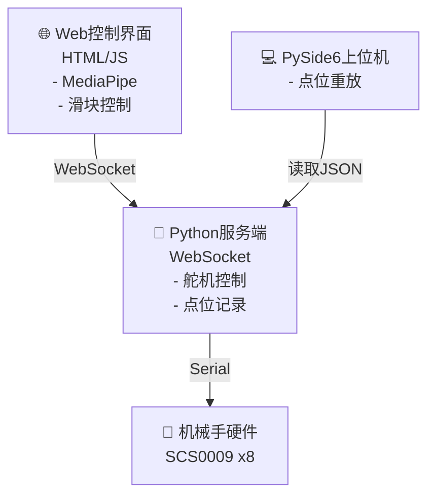

# 🖐️ Case 1: AmazingHand 手势控制与点位重放系统

<div align="center">


**基于 MediaPipe 手势识别的智能机械手控制系统**

</div>

## 📋 项目简介

这是一个完整的机械手控制解决方案，包含三个核心组件：

1. **🌐 WebSocket服务端** - 接收控制指令并驱动舵机
2. **📸 Web控制界面** - 支持手势识别和手动控制
3. **💻 点位重放上位机** - 记录并重放机械手动作

## 🖼️ 功能展示

<table>
<tr>
<td></td>
<td></td>
</tr>
<tr>
<td align="center">🎮 Web手势控制界面 - 支持实时手势识别</td>
<td align="center">📊 点位重放上位机 - 动作序列管理</td>
</tr>
</table>

## 📂 文件说明

| 文件 | 📝 说明 |
|------|--------|
| `🐍 websocket_server.py` | WebSocket服务端，负责接收指令、控制舵机、记录点位 |
| `🌐 gesture_control.html` | Web控制界面，支持手势识别(MediaPipe)、滑块控制、点位记录 |
| `💻 playback_gui.py` | PySide6上位机，读取记录的点位JSON并重放 |
| `📄 points_record.json` | 点位数据存储文件（自动生成） |

## ⚙️ 硬件要求

- 🦾 **AmazingHand 机械手**（SCS0009伺服电机 x8）
- 🔌 **串口控制器**（默认端口：`/dev/ttyACM0`）
- 📷 **摄像头**（用于手势识别，可选）

## 🛠️ 软件依赖

```bash
# Python依赖
pip install websockets numpy pyside6
pip install rustypot  # 舵机控制库
```

## 🚀 使用流程

### 📌 Step 1: 启动WebSocket服务端

```bash
python websocket_server.py
```

> ✅ 服务端启动后会：
> - 连接串口控制器
> - 启动WebSocket服务（ws://localhost:8765）
> - 等待Web界面连接

---

### 📌 Step 2: 打开Web控制界面

用浏览器打开 `gesture_control.html`

> 🎮 **主要功能**：
> - **🤝 混合控制模式** - 开启后通过摄像头手势控制弯曲，滑块控制左右摆动
> - **🎚️ 手动模式** - 全部使用滑块控制
> - **✋ 静态姿态** - 快速切换到张开/握拳
> - **🎬 动态演示** - 预设动画（食指勾引、挥手、波浪等）
> - **⏺️ 记录点位** - 点击红色按钮记录当前舵机位置

---

### 📌 Step 3: 记录动作点位

1. 🎯 通过滑块或手势调整机械手到目标姿态
2. ⏺️ 点击 "🔴 记录当前点位" 按钮
3. 💾 点位自动保存到 `points_record.json`

---

### 📌 Step 4: 使用上位机重放

```bash
python playback_gui.py
```

> 💻 **上位机功能**：
> - 📂 加载点位JSON文件
> - 🎯 选择点位单独执行（双击或点击"执行选中"）
> - ▶️ 连续播放所有点位（可调节间隔时间）
> - ⚡ 调节舵机速度

## 📊 点位数据格式

```json
{
  "点位_1": {
    "timestamp": "2025-12-18 15:55:22",
    "servos": {
      "11": { "position": 2381, "angle": 29.3 },
      "12": { "position": 1741, "angle": -26.95 },
      ...
    }
  }
}
```

- 📏 `position`: 舵机脉冲值（0-4096，中心2048）
- 📐 `angle`: 对应角度（度）

## 🔧 舵机配置

| 手指 | 电机1 ID (弯曲) | 电机2 ID (偏摆) |
|------|----------------|----------------|
| 👍 大拇指 (Thumb) | 11 | 12 |
| 👉 无名指 (Ring) | 13 | 14 |
| ☝️ 中指 (Middle) | 15 | 16 |
| 🤟 食指 (Index) | 17 | 18 |

## 🏗️ 技术架构



## ⚠️ 注意事项

> 🔔 **重要提醒**：
>
> 1. 🔒 确保串口权限：`sudo chmod 666 /dev/ttyACM0`
> 2. 🔒 Web界面需要HTTPS或localhost才能使用摄像头
> 3. ⚡ 断开连接前会自动关闭舵机扭矩

## 📜 License

<div align="center">


MIT License

</div>

---

<div align="center">

**[⬆️ 返回顶部](#-case-1-amazinghand-手势控制与点位重放系统)** |
**[🔙 返回主项目](../README.md)**

Made with ❤️ by AmazingHand Team

</div>
